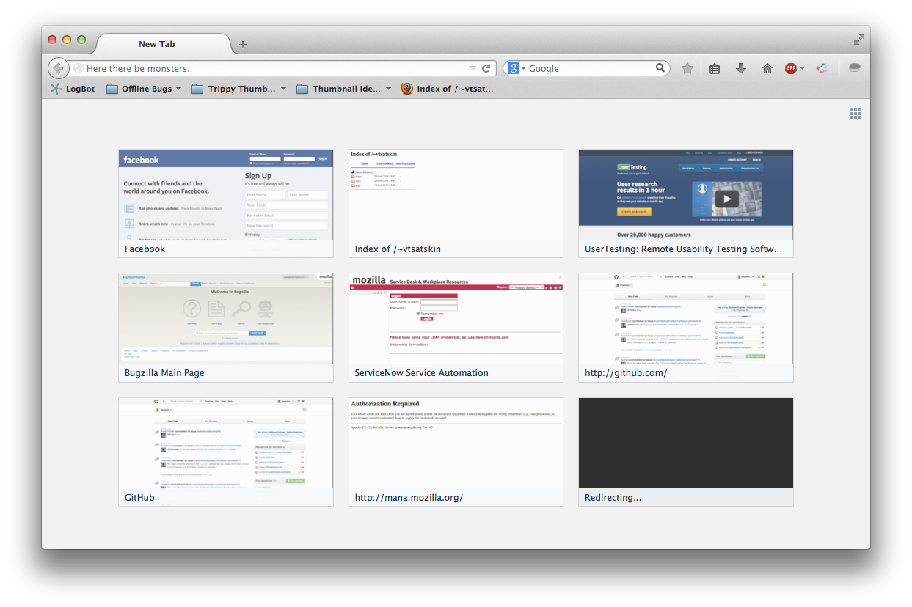
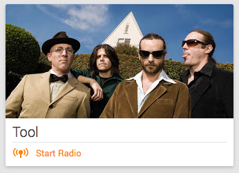
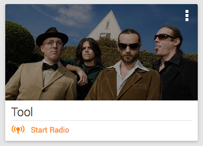
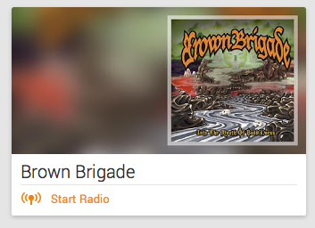
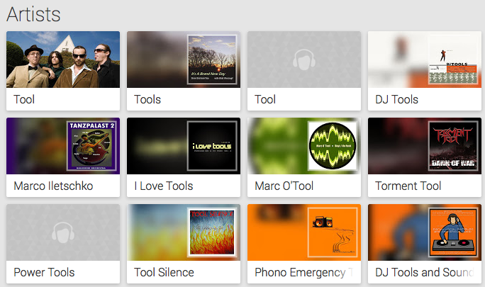
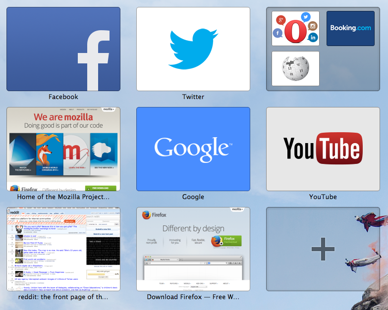

TrippyThumbs
============

An experimental approach to website thumbnails.

Mockups
-------

Sample websites
---------------

These are websites to try generating thumbnails from.

- [Facebook](http://facebook.com)
	- Facebook profile page
- [Google](http://google.com)
- [An Erowid Article](http://www.erowid.org/plants/tobacco/tobacco.shtml)
- [Github](https://github.com/)
- [A GitHub Profile](https://github.com/vtsatskin)
- [YouTube](http://youtube.com)

Identification Technqiues
----------------------------

These are certain aspects we can use from websites to generate identifiablity cues

- Logo
- Prominant picture on website
- Website dominant colours
- Title
- URL

Current Behaviour and Issues
----------------------------

These are the current issues with the existing thumbnails

- Redirect got captured as a page
- Duplicates: https and http version
- "Authorization Required" on sites with http auth such as [Mana](http://mana.mozilla.org)

Inspiration
-----------

### Google Play Music ###

- Relevant band image shown
- Hover state is interactable

- Album art as background with blur
- Displayed when no band image availible

### Opera Speed Dial ###

- Some website such as Facebook, YouTube, Google, Twitter, will show logos.
- Others will show screenshot

### Interactions/Effects ###

- [Caption Hover Effects](http://tympanus.net/Tutorials/CaptionHoverEffects/index3.html)
- [Shape Hover Effect with SVG](http://tympanus.net/Tutorials/ShapeHoverEffectSVG/index2.html)

Existing Research
-----------------

- [How People Recognize Previously Seen WWW Pages from Titles, URLs and Thumbnails][recognize] by Kaasten, S., Greenberg, S. and Edwards, C. (2002)

[recognize]:http://grouplab.cpsc.ucalgary.ca/Publications/2002-ThumbnailStudy.BHCI