# Smart Tiles Discovery

## Editing Tiles

Editing a normal website tile. This brings up a popover which allows editing of
the url and name.
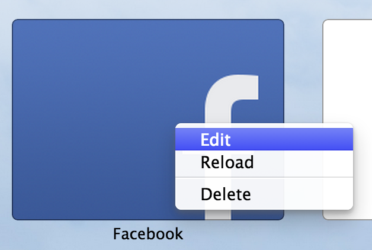

Editing a smart tile. This option opens a new page which the extension must
build. The options can sometimes be left out and will be greyed out if not
available.
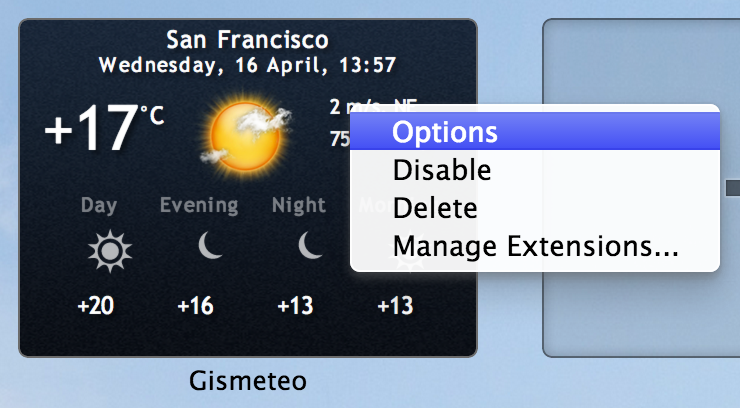

## TED.com

Shows and links to a single ted talk in tile.

## Gmail

Shows an unread email count from the currently logged in user.

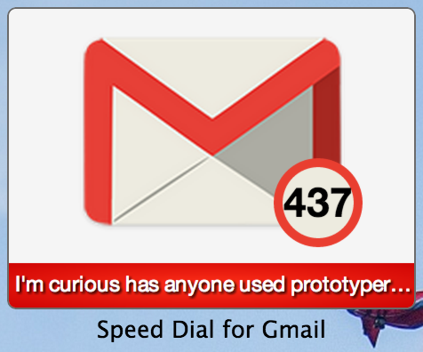

However, there is no indication that the user needs to log in. Below is a
screenshot of when a user is not logged in.

There is also duplication of results in the search results. One for just the
page and the other for the smart tile.

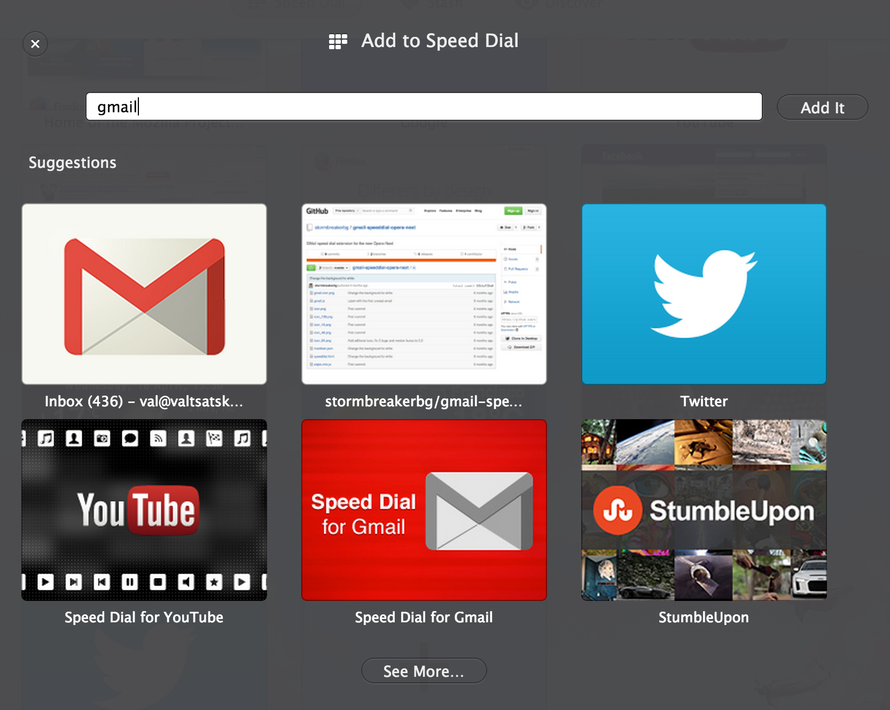

## Stumbleupon

Cycles through stumbleupon links as well as advertises to the user they should
sign up.

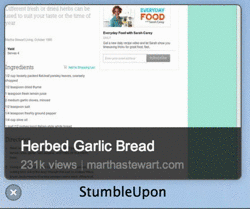

## yr.no Weather

Links user to [external page](yr.setup.instructions.pdf) for setup of tile.

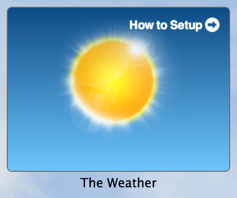

After setup the user is shown weather information. Clicking the tile will lead
the user to an appropriate weather page.

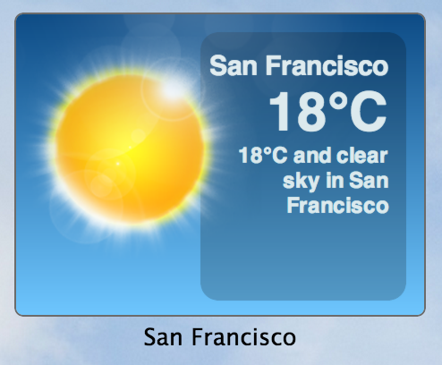

## Gismeteo Weather

Gismeteo skips the setup sets required in yr.no and automatically finds the
user's current location.

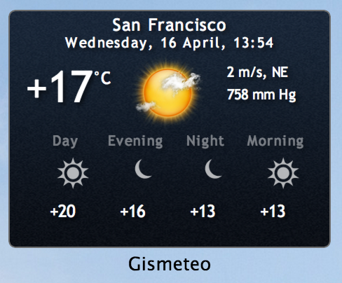

Editing the tile as in section "Editing Tiles" brings up the following page.

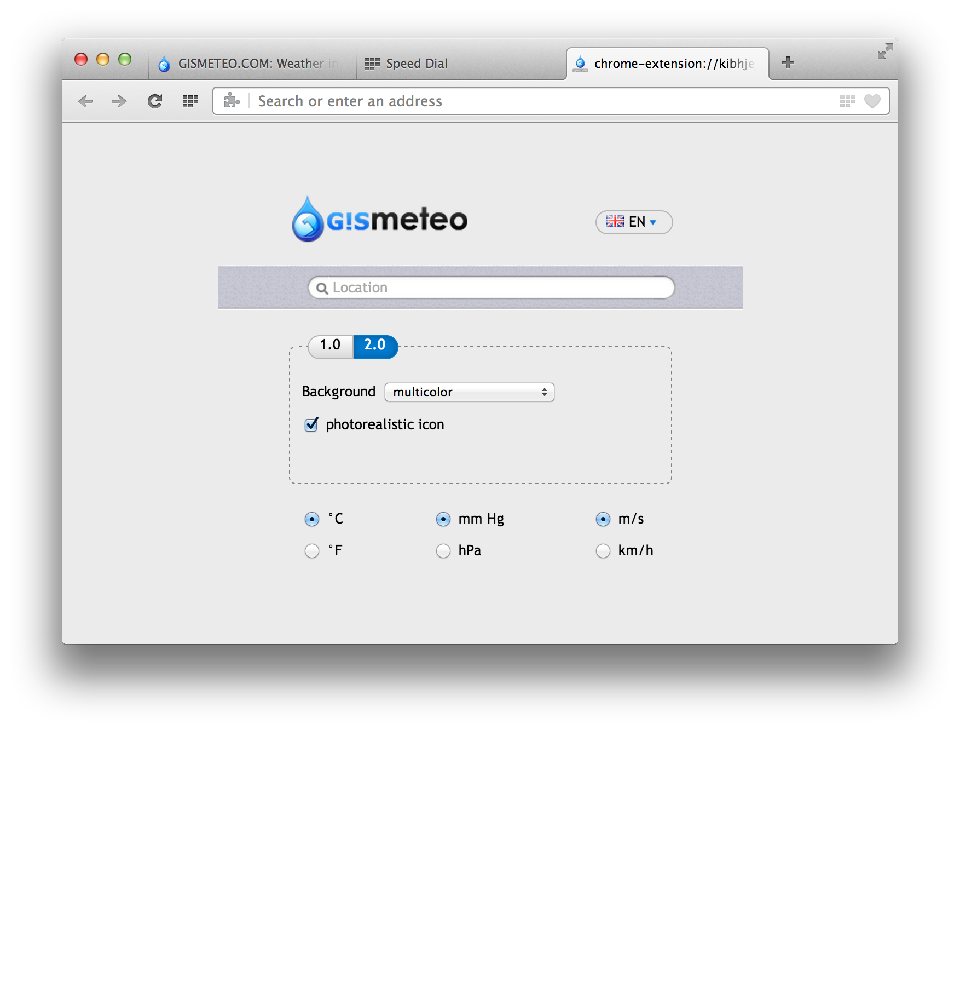

## YouTube

YouTube works similar to the stumbleupon tile, where it's a carrousel of videos.
However, the styling is slightly different from Stumbleupon's.

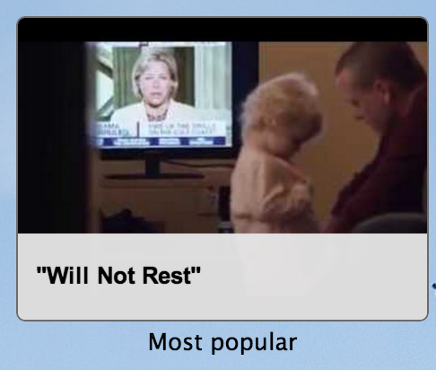

The options for the tile.

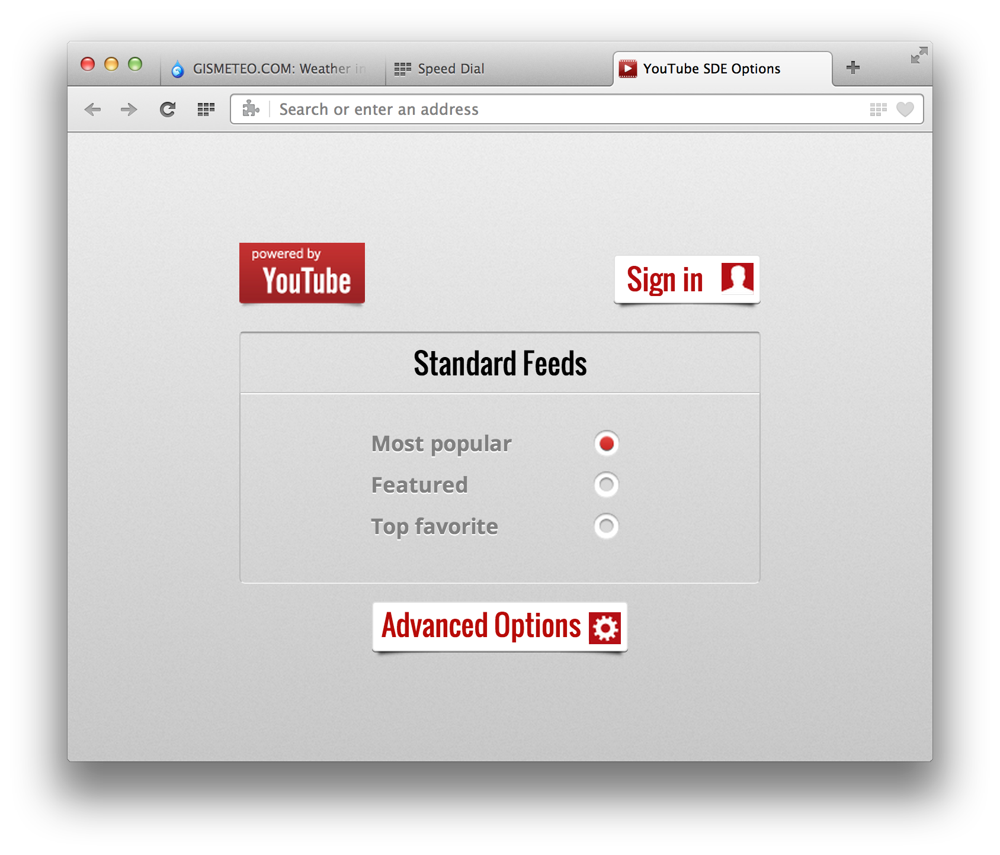

## Facebook

A carrousel of photos from your Facebook feed. Also includes your notification
numbers.

See [Speed Dial for Facebook][facebook-tile] for more info.

[facebook-tile]:https://addons.opera.com/en/extensions/details/speed-dial-for-facebook/
