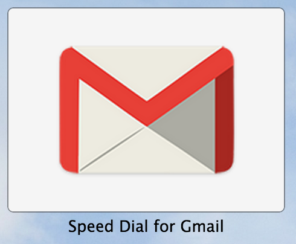

# Smart Tiles Discovery

## TED.com

Shows and links to a single ted talk in tile.

## Gmail

Shows an unread email count from the currently logged in user.

However, there is no indication that the user needs to log in. Below is a
screenshot of when a user is not logged in.

There is also duplication of results in the search results. One for just the
page and the other for the smart tile.

## Stumbleupon

Cycles through stumbleupon links as well as advertises to the user they should
sign up.

